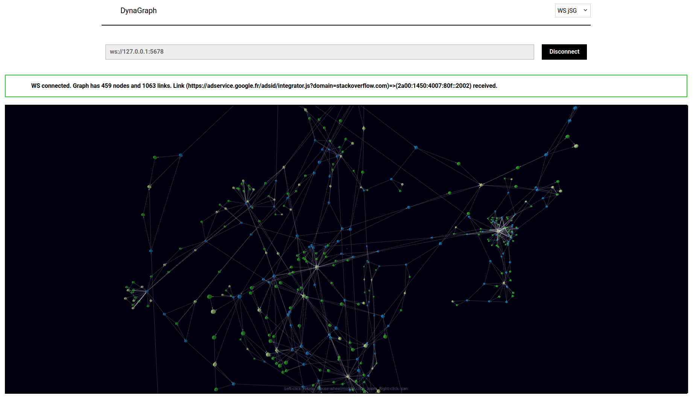
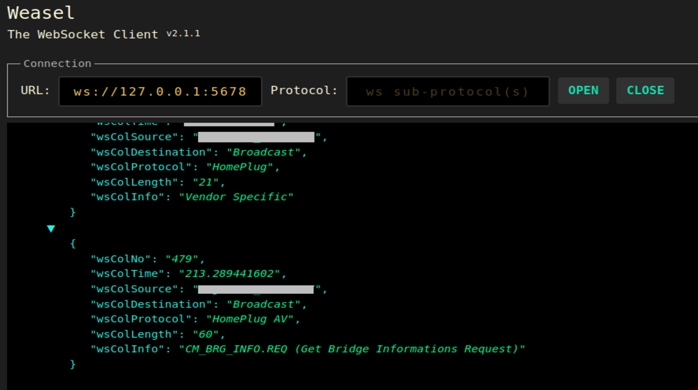

# DynaGraph

The *DynaGraph framework*:  
a system combining classical *traces dumping tools* (i.e. the `tshark` tool and Firefox's Network Monitor component) and a ReactJS web app for live 3D graph rendering of streamed graph data derived from traces.



Related paper:
>Lionel TAILHARDAT, Raphaël TRONCY, and Yoan CHABOT. 2022.
> Walks in Cyberspace: Improving Web Browsing and Network Activity Analysis With 3D Live Graph Rendering.
> In Companion Proceedings of the Web Conference 2022 (WWW ’22 Companion), April 25–29, 2022, Virtual Event, Lyon, France.
> ACM, New York, NY, USA, 6 pages. https://doi.org/10.1145/3487553.3524230

Cite:
```bibtex
@inproceedings{10.1145/3487553.3524230,
  title = {Walks in Cyberspace: Towards Better Web Browsing and Network Activity Analysis with 3D Live Graph Rendering},
  author = {{Lionel Tailhardat} and {Rapha\"el Troncy} and {Yoan Chabot}},
  publisher = {Association for Computing Machinery},
  year = {2022},
  doi = {10.1145/3487553.3524230}
}
```

## Requirements

Data collection:
* [Python](https://www.python.org/) (v3.8+), see also [data-collection/](data-collection)
* [tshark](https://www.wireshark.org/docs/man-pages/tshark.html) (tested with tshark v3.2.3)
* Web browser with network monitoring and HAR file saving capabilities (e.g. [Firefox](https://www.mozilla.org/en-US/firefox/new/), [Microsoft Edge](https://www.microsoft.com/en-US/edge), etc.)

Data visualization:
* [Node.js](https://nodejs.org) (v14.x - v16.x), see also [package.json](package.json)
* Web browser

## Quick start

* Git clone the project to your computer and change directory to the project directory,
* Install the DynaGraph Web app dependencies with the `npm install` CLI command, 
* Launch the DynaGraph Web app with the `npm run start` CLI command,
* Install the Python data generation script dependencies with the `pip install -r data-collection/requirements.txt` CLI command,
* Launch the random data generation script with the `python data-collection/ws_server.py` CLI command,
* Open the DynaGraph Web app UI available at http://localhost:3000/
* Select the `WS jSg` source method (upper-right drop-down list),
* Set the `ws://127.0.0.1:5678` source and click the `Connect` button,
* Observe and play with incoming graph data in the rendering pane.

## Usage

We provide detailed usage directions of the DynaGraph framework in sections below.

See the "*[Experiments](#experiments)*" Section for directions about the experiments setup provided in the "*Walks in Cyberspace*" paper.

### Data collection

#### Live packet capture
Assuming that
* network packets carry useful information at basic fields level,
* network packet capture should be launched in a programmatic way,

we propose a network capture and processing tool chain based on the combination of the `tshark` tool and an adhoc script for data processing and forwarding.
We provide a standard data forwarding process towards downstream components (e.g. data visualization) by using the [WebSockets protocol](https://rfc-editor.org/rfc/rfc6455.txt).
Listing below shows how we call this tool chain.
```shell
# Capture net traffic, export as CSV, transform and send as jSon
# Press Ctrl-C to stop the process
tshark -T fields -l -E separator=, -E quote=d \
  -e _ws.col.No. -e _ws.col.Time \
  -e _ws.col.Source \
  -e _ws.col.Destination \
  -e _ws.col.Protocol \
  -e _ws.col.Length -e _ws.col.Info \
  -f "ip" | \
python ws_server_stdin.py
```

##### Functional and implementation overview.
Network packet capture is ensured by the `tshark` tool.
In order to be more specific on `tshark` capture behavior, a *capture filter* can be set with the `-f` commutator.
See Wireshark's [CaptureFilters](https://gitlab.com/wireshark/wireshark/-/wikis/CaptureFilters) documentation for syntax insights.
Packets information are filtered and exported as CSV data (`-T fields`, `-E` and `-e` commutators) to *stdout* in a one-line-per-packet fashion (`-l` commutator).
With help of pipes (`|`), a downstream script (see [data-collection/ws_server_stdin.py](data-collection/ws_server_stdin.py)) maps each packet information to the web app input schemata and then forward them through a WebSockets server instance with help of the `websockets` package.


#### Web browser network capture

Assuming that,
* network packets capture tools may not be available at host level,
* web browsers have the capability to analyze web transactions done by the user,

we propose a network capture at web browser's level with in-browser monitoring features, followed by an *a posteriori* method for processing/forwarding saved web navigation data.
We use the [HAR](https://w3c.github.io/web-performance/specs/HAR/Overview.html) file format for saving web navigation data.
As for the *Live packet capture* method (see above), we provide a standard data forwarding process by using the WebSockets protocol.

##### Functional and implementation overview.

Network packet capture is ensured by the *Network Monitor* component that is part of the Firefox Developer Tools (see [developer.mozilla.org/en-US/docs/Tools](https://developer.mozilla.org/en-US/docs/Tools) for an overview).
Traffic recording requires the user to do the following tasks:
1. launch a Firefox browser instance,
2. open the *network monitor* console (can be done with the `Ctrl+Shift+E` shortcut),
3. activate the *Persist logs* option,
4. browse the web in the same tab and without closing the monitor console,
5. save the recorder traffic as a HAR file.

HAR file processing and data forwarding is ensured by a Python script (see [data-collection/ws_server_har2.py](data-collection/ws_server_har2.py)).
HAR entries are parsed with help of the `haralyzer` package.
Each entry is decomposed into three links declarations following the web app input data schemata :
* a time-stamped *browser* node => *url* link,
* a time-stamped *browser* node => *server* link,
* a *url* node => *server* link.

Time-stamped *browser* nodes denote the time period at which *url* and *server* access events occur.
The track of time is materialized by links between *browser* nodes of increasing time stamps.
Events are grouped into time buckets (i.e. linked to the same *browser* node) with help of a relative time comparison function (see `deltaThreshold` variable).
This set of links is then forwarded as jSon data to downstream components through a WebSockets server instance with help of the `websockets` package.

#### Random data generation
Assuming that,
* no web navigation session is on-going,
* the DynaGraph Web app needs to be tested,

we propose a simple random data generation script (see [data-collection/ws_server.py](data-collection/ws_server.py)).
Again, we provide a standard data forwarding process by using the WebSockets protocol.

##### Functional and implementation overview.
This script basically:
* activates a WebSockets server with help of the [websockets](https://github.com/aaugustin/websockets) package,
* runs a message generation process in an infinite loop.

Messages follow the Web app data schemata where `source` and `target` are randomly generated identifiers.
Unless using modified scripts, the WebSockets server opens a socket at `ws://127.0.0.1:5678`.

### Data visualization : WebSocket client and 3D graphs web app

Assuming that
* no additional software will be installed on the analyst computer,
* multiple analysts may wish to observe the same stream of data,

we propose a web app for fetching and rendering data from the *data collection* components in a one-to-many fashion.
For this, we provide a standard data fetching process by using the WebSockets protocol.
Following the data fetching stage, we add data to a graph structure after deduplication (i.e. do not add vertices/edges to graph if they already exist), then make use of a third party module for client-side 3D graph data rendering.

Launch the web app with the `npm run start` CLI command.

#### Functional and implementation overview

Data loading is available in two ways:
* *dynamic graph* data (stream) is acquired through a WebSockets connection,
* *static graph* data is done by opening local files stored in [JSON Graph](http://jsongraphformat.info/) syntax.

Correspondingly, we developed a Web app architecture taking *data loading* features as roots for the internal component hierarchy:
```
App
├─Select
├─ProcessingBlockRouter
├─ProcBlockWSJSG
| ├─UriInput
| ├─ConnectButton
| └─RenderBlockFileJSG
|   ├─Alert
|   ├─BasicForceGraph3D
|   ├─NodeFocusSelect
|   └─SaveButton
└─ProcBlockFileJSG
  ├─FilePicker
  └─RenderBlockFileJSG
    ├─Alert
    ├─BasicForceGraph3D
    ├─NodeFocusSelect
    └─SaveButton
```

The WebSockets client is handled at the `RenderBlockWSJSG` web app component level  and is implemented with an [auto-reconnection feature](https://dev.to/finallynero/using-websockets-in-react-4fkp).
A per-message processing strategy is applied where each message is a graph link description.
Streamed graph data is expected to arrive in jSon syntax with a predefined scheme (see below).
Nodes and links are added to the graph structure if they do not already exist.
Automatic update of the graph rendering component is ensured by the use of a [React *state*](https://reactjs.org/docs/state-and-lifecycle.html) for the graph structure storage.

```json
{
  "source": "node1_id",
  "sourceGroup": "group1",
  "target": "node2_id",
  "targetGroup": "group2",
  "time": "2021-09-08T10:35:12.138208Z",
  "value": 100
}
```
Graph rendering (see `BasicForceGraph3D` component) is implemented upon the [react-force-graph](https://github.com/vasturiano/react-force-graph), an interactive 3D graph rendering component with force layout.

Additional UI components and features are available in order to ease navigating the graph:
* an `Alert` component to inform the user on data loading status and basic graph statistics,
* a searchable drop-down list with nodes IDs (see `NodeFocusSelect` component) to explore available nodes and set focus on a specific node in the rendering pane,
* a node `onClick` handler to make the camera focus node in the rendering pane,
* a `SaveButton` component to download the current graph structure.

From above, typical web app usage scenarios can be one of the following, or alike:
* select `WebSocket` connector => enter WebSocket URI => connect => observe graph => focus on node,
* select `File` connector => pick a jSon Graph file => open => observe graph => focus on node.

## Experiments

### Testing Environment
Experiments were carried out on a Dell Precision 5750 laptop with a Ubuntu 20.04.3 LTS operating system, Firefox 91.0.2 and tshark 3.2.3.

### Web app code validation

The DynaGraph web app is launched from the CLI with the `npm run start` command, and then accessed via Firefox at http://localhost:3000/.
Web app is monitored from its CLI logs and the Firefox Web console.

Testing the `ProcBlockWSJSG` is carried out, with help of the random data generation script (see [data-collection/ws_server.py](data-collection/ws_server.py)), through the following steps:
* DynaGraph is set to the `WS jSG` mode through its UI,
* The `ws://127.0.0.1:5678` URI is set,
* The `Connect` button is clicked to launch a connexion request,
* The random data generation script is launched from the CLI with the `python ./ws_server.py` command.

Correct live graph rendering is then carried out by visual observation.
In addition, checking consistency of messages sent from the WebSockets server instance is done with the [*WebSocket Waesel*](https://addons.mozilla.org/fr/firefox/addon/websocket-weasel/) Firefox add-on (see screenshot below).



Testing `ProcBlockFileJSG` is carried out with help of [miserable.json](data-samples/miserables.json) sample dataset provided with the `react-force-graph` component (see [here](https://github.com/vasturiano/react-force-graph/blob/master/example/datasets/miserables.json)) and the random data generation script :
* DynaGraph is set to the `File jSG` mode through its UI,
* A local copy of the `miserable.json` file is picked.

Correct static graph rendering is then carried out by visual observation.


### Live packet capture
The DynaGraph web app is launched, then evaluation with live packet capture is carried out with help of the `tshark` tool chain:
* DynaGraph is set to the `WS jSG` mode through its UI,
* The `ws://127.0.0.1:5678` URI is set,
* The `Connect` button is clicked to launch a connexion request,
* The tool chain is launched from the CLI with the "*capture net traffic*" command discussed in the [Data collection](#data-collection) Section.
* An arbitrary web navigation session is conducted from another Firefox instance in order to produce network traffic.

An arbitrary web navigation session is conducted from another Firefox instance in order to produce network traffic.
Correct live graph rendering is then carried out by visual observation, including the delay between notifications of new nodes/links (\verb|Alert| component) and the addition of nodes/links to the graph rendering pane.
Web app reactivity is tested by visual observation of camera rotation smoothness when manipulating the rendering pane.

In addition, the usefulness of Firefox "history" records was checked in order to allow for tshark/Firefox history comparison.
History records is read from the Firefox database with the following CLI command (see [here](https://aurelieherbelot.net/web/read-firefox-history-linux-terminal/) for reference):
```shell
sqlite3 ./places.sqlite "SELECT datetime(moz_historyvisits.visit_date/1000000,'unixepoch'), moz_places.url FROM moz_places, moz_historyvisits WHERE moz_places.id = moz_historyvisits.place_id" | sort | less
```

### Web browser network capture
This experiment is a two-step process:
* capturing network traffic of an arbitrary web navigation session from a Firefox instance,
* processing and forwarding captured traffic to a DynaGraph instance.

Evaluation with captured traffic is carried out, with help of the HAR tool chain, through the following steps:
* DynaGraph is set to the `WS jSG` mode through its UI,
* The `ws://127.0.0.1:5678` URI is set,
* The `Connect` button is clicked to launch a connexion request,
* The tool chain is launched from the CLI with the `python ./ws_server_har2.py` command.

Correct live graph rendering is then carried out by visual observation, including the following of the time track by setting the focus on subsequent "browser" nodes.
Evaluation of the `deltaThreshold` parameter effect is done by conducting the above 4 steps on the same dataset with varied `deltaThreshold` settings.
Here, the dataset is a HAR file with 656 requests generated from an arbitrary web navigation session of 1 minute duration (06 Sep 2021 22:16:43 GMT to 06 Sep 2021 22:17:43 GMT).

Additional network traffic captures were conducted with TLS decryption in mind in order to allow for tshark/Firefox Network Monitor comparison.
Firefox and Chrome web browsers can export TLS keys *for later decryption* by the tshark tool (i.e. no live decryption).

The overall procedure is as follows:
* Launch a tshark network capture with data dumping to a file (see code below).
* Do the above mentioned two-step process where the Firefox instance is launched from the CLI with the `SSLKEYLOGFILE=~/.ssl-key.log firefox` command for keys export (for security concerns, don't forget to delete the file after usage !).
* Open the tshark captured file for TLS decryption (see [here](https://resources.infosecinstitute.com/topic/decrypting-ssl-tls-traffic-with-wireshark/) and [here](https://tshark.dev/export/export_tls/) for operational details).

```shell
tshark -Q -a duration:30 \
  -f "tcp port http or https" \
  -w /tmp/http_https_netsniff.pcapng & \
  SSLKEYLOGFILE=/tmp/ssl-key.log firefox
```


## Contributing

:point_right:  Create an *issue* or a *Merge Request*.

:point_right:  See `TODO` tags in code for things to develop or think about.

## License

[BSD-4-Clause](LICENSE.txt)

## Copyright

Copyright (c) 2021-2022, [Orange](https://hellofuture.orange.com/) & [EURECOM](https://www.eurecom.fr/). All rights reserved.

## Maintainer

* [Lionel TAILHARDAT](lionel.tailhardat@orange.com)
* [Yoan CHABOT](yoan.chabot@orange.com)
* [Raphaël TRONCY](raphael.troncy@eurecom.fr)

